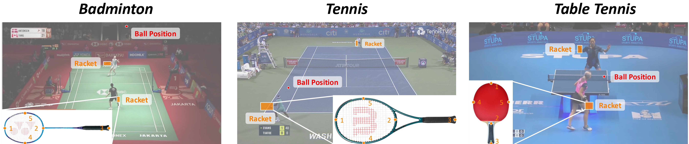

# RacketVision: A Multiple Racket Sports Benchmark for Unified Ball and Racket Analysis

<!-- [](https://arxiv.org/abs/20xx.xxxxx) -->
[](https://arxiv.org/)
[](https://aaai.org/)

**RacketVision** is a large-scale, multi-sport benchmark for advancing computer vision in sports analytics, covering table tennis, tennis, and badminton. It introduces fine-grained annotations for **racket pose** alongside traditional ball positions.



## 📢 News
* **[2025-11]** Our paper is accepted by **AAAI 2026 (Oral)**! 🎉
* **[Coming Soon]** The code and dataset are being organized and will be released shortly. Please star this repo for updates!

## ✨ Highlights
* **Multi-Sport:** Unified analysis for Badminton, Tennis, and Table Tennis.
* **New Task:** The first large-scale dataset supporting **Racket Pose Estimation**.
* **Benchmark:** Baselines for Ball Tracking, Racket Pose Estimation, and Trajectory Prediction.

##  citation
If you find our work useful for your research, please consider citing:

```bibtex
@inproceedings{dong2026racket,
  title={Racket Vision: A Multiple Racket Sports Benchmark for Unified Ball and Racket Analysis},
  author={Dong, Linfeng and Yang, Yuchen and Wu, Hao and Wang, Wei and Hou, Yuenan and Zhong, Zhihang and Sun, Xiao},
  booktitle={Proceedings of the AAAI Conference on Artificial Intelligence (AAAI)},
  year={2026}
}