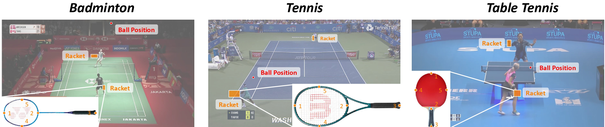

# RacketVision: A Multiple Racket Sports Benchmark for Unified Ball and Racket Analysis
RacketVision is a new benchmark dataset of table tennis, tennis, and badminton for ball tracking, racket pose estimation, and trajectory prediction to improve sports analytics.




## Getting Started
### Downloading the Dataset
Download the dataset from [here](https://drive.google.com/file/d/1fdnmmuUPYd2tf0WKloGW5kYVNcifvz2X/view?usp=drive_link) and put it in `./data` folder.
### Preprocess
Extract the frames from video clips by run
```
cd data
python ../preprocess/extract_frames.py
```

## Data Description

### Annotations
- **Ground Truth Annotations** (`annotations.json`): Contains frame-wise annotations for:
  - Ball: Pixel-level format `["Visibility", "X", "Y"]`
  - Racket: Format `["Bbox", "Pose"]` with 5 keypoints (top, bottom, left, right, handle bottom)

### Dataset Information
- **Dataset Info** (`dataset_info.json`): Contains metadata for each clip including:
  - Clip UID and ID
  - Sport type
  - Video properties (FPS, resolution, duration)
  - File paths for videos and frames
  - Median frame information

### Processed Data
- **Soft Ball Labels**: Merged ground truth and predicted ball position labels with confidence scores
- **Soft Racket Labels**: Merged ground truth and predicted racket pose labels
- **Frames**: Extracted frames from the video clips
- **Median Frames**: Background frames for each match

### Sports
The dataset covers three racket sports:
1. Badminton
2. Tennis
3. Table Tennis

Each sport follows the same directory structure and annotation format.

## Usage Notes
- Videos are provided in high resolution (1920x1080)
- Frame rates vary from 25fps to 60fps across clips
- Annotations are provided for 20% of frames, evenly sampled per clip
- Racket annotations are only provided when at least three keypoints are clearly visible

## Annotation Details

### Ball Annotations
- Format: `["Visibility", "X", "Y"]`
- Visibility: Binary value indicating if the ball is visible in the frame
- X, Y: Pixel coordinates of the ball center
- Annotations are provided for 20% of frames, evenly sampled

### Racket Annotations
- Format: `["Bbox", "Pose"]`
- Bbox: Bounding box coordinates [x1, y1, x2, y2]
- Pose: 5 keypoints defining the racket pose
  - Top point
  - Bottom point
  - Left point
  - Right point
  - Handle bottom point
- Annotations are only provided when at least three keypoints are clearly visible


## Directory Structure Details

The structure of the dataset is as follows:
```
data/
├── annotations/
│   ├── annotations.json        # Ground truth ball and racket annotations
│   ├── dataset_info.json       # Dataset metadata and clip information
│   └── clip_id_to_uid.json     # Mapping between clip IDs and UIDs
│
├── badminton/
│   ├── all/
│   │   └── match*/            # Match directories (match1, match2, etc.)
│   │       ├── median.png     # Background median images
│   │       └── frame/         # Extracted frames directory
│   │           └── */         # Clip directories (000, 001, etc.)
│   │               ├── 0000.jpg
│   │               ├── 0001.jpg
│   │               └── ...    # Sequential frame images
│   ├── videos/
│   │   └── match*_*.mp4      # Original video files
│   ├── smoothed_ball/
│   │   └── match*/           # Match directories
│   │       └── */            # Clip directories (000, 001, etc.)
│   │           └── results_smooth.csv  # Soft ball labels
│   └── merged_racket/
│       └── match*/           # Match directories
│           └── */            # Clip directories
│               └── result.json  # Soft racket labels
│
├── tennis/                    # Same structure as badminton
└── tabletennis/             # Same structure as badminton
```

### Annotations Directory
- Contains all ground truth annotation and metadata files

### Sport-specific Directories
Each sport (badminton, tennis, tabletennis) contains:
- `all/`: Background median frames
- `videos/`: Original video clip files
- `smoothed_ball/`: Soft ball labels
- `merged_racket/`: Soft racket labels

### Match and Clip Organization
- Matches are organized in numbered directories (match1, match2, etc.)
- Clips within matches are organized in numbered directories (000, 001, etc.)
- Each clip directory contains its specific annotations and processed labels
