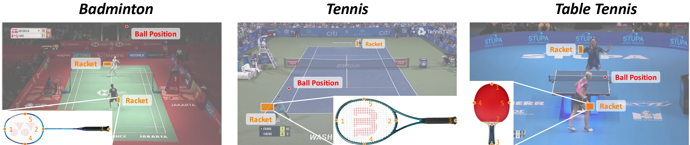

# RacketVision: A Multiple Racket Sports Benchmark for Unified Ball and Racket Analysis

[](https://arxiv.org/abs/2511.17045)
[](https://aaai.org/)
[](https://github.com/OrcustD/RacketVision)
[](https://huggingface.co/datasets/linfeng302/RacketVision)
[](https://huggingface.co/linfeng302/RacketVision-Models)
[](LICENSE)

**RacketVision** is a large-scale, multi-sport dataset and benchmark for advancing computer vision in sports analytics, covering **badminton**, **table tennis**, and **tennis**. It is the first dataset to provide large-scale, fine-grained annotations for racket pose alongside traditional ball positions, enabling research into complex human-object interactions. The benchmark tackles three interconnected tasks: fine-grained **ball tracking**, articulated **racket pose estimation**, and predictive ball **trajectory forecasting**.



## News

* **[2025-11]** Our paper is accepted by **AAAI 2026 (Oral)**!
* **[2026-04]** Code and dataset are released!

## Overview

RacketVision provides a modular pipeline for analysing racket sports videos. The system consists of three stages:

| Stage | Module | Task |
|-------|--------|------|
| 1 | **BallTrack** | Detect and track the ball in each frame |
| 2 | **RacketPose** | Detect rackets and estimate 5-keypoint pose |
| 3 | **TrajPred** | Predict future ball trajectories from ball + racket history |

## Repository Structure

```
RacketVision/
├── README.md               # This file
├── LICENSE
├── assets/                 # Figures for the README
├── scripts/                # Utility scripts (e.g. server-side dataset packing)
├── source/
│   ├── data/               # Dataset root (download here; see §1)
│   ├── DataPreprocess/     # Frame extraction, median background, COCO export
│   ├── BallTrack/          # Ball tracking module
│   ├── RacketPose/         # Racket detection & pose estimation module
│   ├── TrajPred/           # Trajectory prediction module
│   └── download_checkpoints.py
```

> **Paths:** `hf download` targets `source/data/` so that each module’s default `data_root = '../data'` (relative to `source/<Module>/`) resolves correctly. Run `python download_checkpoints.py` from `source/`. Other commands use `source/<Module>/` as the working directory unless noted.

---

## 1. Dataset

### Download

The dataset is hosted on Hugging Face:

```bash
# From the repository root: download into source/data (matches module configs)
hf download linfeng302/RacketVision --repo-type dataset --local-dir source/data
```

All modules use `../data` relative to `source/<Module>/`, which resolves to `source/data/`.

### What's Included

| Content | Description |
|---------|-------------|
| `<sport>/videos/` | Raw video clips (badminton, tabletennis, tennis) |
| `<sport>/all/<match>/csv/` | Ball ground truth annotations |
| `<sport>/all/<match>/racket/` | Racket ground truth annotations (5 keypoints) |
| `<sport>/info/` | Train/val/test splits and COCO-format annotations |
| `<sport>/interp_ball/` | Interpolated ball trajectories (for rebuilding TrajPred data) |
| `<sport>/merged_racket/` | Merged racket predictions (for rebuilding TrajPred data) |
| `info/` | Cross-sport COCO annotations for RacketPose |
| `annotations/` | Global dataset metadata and per-clip annotations |
| `data_traj/` | Pre-built trajectory prediction datasets (PKL) |

For detailed data formats, directory layout, and annotation specifications, see the [dataset card on Hugging Face](https://huggingface.co/datasets/linfeng302/RacketVision).

### Data Preprocessing (Required)

After downloading, **extract frames and compute median backgrounds** before running BallTrack:

```bash
cd source/DataPreprocess

# Extract video frames to JPG
python extract_frames.py --data_root ../data

# Compute median background for each match (used by BallTrack)
python create_median.py --data_root ../data
```

> **Note**: The median background files (`median.npz`) and extracted frames are **not** included in the download to save space. They are regenerated deterministically from the videos by the commands above.

---

## 2. Environment Setup

All three modules share a single conda environment:

```bash
conda create -n uball python=3.10 -y && conda activate uball

# Adjust pytorch-cuda to match your driver (e.g., 11.8, 12.1)
conda install pytorch==2.1.2 torchvision==0.16.2 torchaudio==2.1.2 pytorch-cuda=12.1 -c pytorch -c nvidia -y

pip install -U openmim
mim install "mmengine>=0.10.7"
pip install pandas tqdm scikit-learn parse
```

<details>
<summary><b>Additional dependencies for RacketPose (optional)</b></summary>

RacketPose requires `mmdet` and `mmpose`. You can skip this if you only use the pre-computed racket predictions provided in the dataset.

```bash
mim install "mmcv>=2.0.0rc4,<2.2.0"
mim install "mmdet<3.3.0,>=3.0.0"
mim install "mmpose>=1.1.0" --no-deps
pip install albumentations json_tricks munkres xtcocotools
pip install "numpy>=1.23,<2" "opencv-python<=4.10.0.84"
```

Verify the installation:
```bash
python -c "import mmengine, mmcv, mmpose, mmdet; print('mmengine:', mmengine.__version__, 'mmcv:', mmcv.__version__, 'mmpose:', mmpose.__version__, 'mmdet:', mmdet.__version__)"
```

> **Note**: On CUDA >= 12.8, `mim install mmcv` may fail on newer GPUs. In that case, build MMCV from source — see [mmcv#3327](https://github.com/open-mmlab/mmcv/issues/3327).

</details>

---

## 3. Pre-trained Checkpoints

Download all pre-trained weights with a single command:

```bash
cd source
python download_checkpoints.py
```

Or download for a specific module:

```bash
cd source
python download_checkpoints.py --module BallTrack
python download_checkpoints.py --module TrajPred --sport badminton
```

The script places checkpoints under `source/BallTrack/checkpoints/`, `source/RacketPose/checkpoints/`, and `source/TrajPred/checkpoints/`. Requires `huggingface_hub` (`pip install huggingface_hub`).

---

## 4. BallTrack — Ball Detection & Tracking

TrackNetV3 takes sequences of video frames plus a median background image and outputs per-frame heatmaps from which ball position is decoded.

### Evaluation

```bash
cd source/BallTrack

# Evaluate on all sports
python test.py --cfg configs/tracknetv3_base.py \
               --ckpt checkpoints/balltrack_best.pth

# Evaluate on a single sport
python test.py --cfg configs/tracknetv3_base.py \
               --ckpt checkpoints/balltrack_best.pth \
               --sport badminton
```

### Inference

Generate ball predictions for all clips in a split:

```bash
cd source/BallTrack
python inference.py --cfg configs/tracknetv3_base.py \
                    --ckpt checkpoints/balltrack_best.pth \
                    --sport badminton --split test
```

Output: `source/data/<sport>/pred_ball/<match>/<rally>/results.csv`

### Training

```bash
cd source/BallTrack
python train.py --cfg configs/tracknetv3_base.py
```

> For detailed config parameters and architecture description, see [`source/BallTrack/README.md`](source/BallTrack/README.md).

---

## 5. RacketPose — Racket Detection & Pose Estimation

A two-stage pipeline: **RTMDet-M** detects racket bounding boxes (3 sport-specific classes), then **RTMPose-M** estimates 5 keypoints per racket (`top`, `bottom`, `handle`, `left`, `right`).

> Requires `mmdet` and `mmpose` — see [environment setup](#2-environment-setup).

### Evaluation

```bash
cd source/RacketPose

# Detection
python tools/test_detection.py configs/detection/rtmdet_m_racket.py \
    --checkpoint checkpoints/epoch_300.pth

# Pose estimation
python tools/test_pose.py configs/pose/rtmpose_m_racket.py \
    --checkpoint checkpoints/best_PCK_epoch_90.pth
```

### Inference

Run detection + pose estimation on video frames:

```bash
cd source/RacketPose
python tools/inference.py \
    --sport badminton --split test --device cuda
```

Output: `source/data/<sport>/pred_racket/<match>/<rally>/result.json`

### Training

```bash
cd source/RacketPose

# Detection (RTMDet)
python tools/train_detection.py configs/detection/rtmdet_m_racket.py

# Pose estimation (RTMPose)
python tools/train_pose.py configs/pose/rtmpose_m_racket.py
```

> For config details, inference options, and output format, see [`source/RacketPose/README.md`](source/RacketPose/README.md).

---

## 6. TrajPred — Trajectory Prediction

CrossLSTM-Attn predicts future ball trajectories conditioned on historical ball positions and racket poses. It uses cross-attention to fuse ball and racket features, outperforming naive concatenation and unimodal baselines.

### Evaluation

```bash
cd source/TrajPred
python test.py --cfg configs/crosslstm_long_badminton.py \
               --ckpt checkpoints/crosslstm_long_badminton.pth
```

### Training

```bash
cd source/TrajPred
python train.py --cfg configs/crosslstm_long_badminton.py
```

### Rebuilding Trajectory Data (Optional)

Pre-built PKL files are provided in `source/data/data_traj/`. To regenerate from scratch after running BallTrack and RacketPose inference:

```bash
cd source/TrajPred

# 1. Interpolate gaps in ball trajectories
python linear_interpolate_ball_traj.py --data_root ../data --sport badminton

# 2. Merge racket predictions with ground truth
python merge_gt_with_predictions.py --data_root ../data --sport badminton

# 3. Build PKL dataset
python build_dataset.py --data_root ../data --sport badminton --history 80 --future 20
```

> For model architectures, metrics, and data pipeline details, see [`source/TrajPred/README.md`](source/TrajPred/README.md).

---

## Citation

If you find this work useful, please consider citing:

```bibtex
@inproceedings{dong2026racket,
  title={Racket Vision: A Multiple Racket Sports Benchmark for Unified Ball and Racket Analysis},
  author={Dong, Linfeng and Yang, Yuchen and Wu, Hao and Wang, Wei and Hou, Yuenan and Zhong, Zhihang and Sun, Xiao},
  booktitle={Proceedings of the AAAI Conference on Artificial Intelligence (AAAI)},
  year={2026}
}
```

## License

This project is released under the [MIT License](LICENSE).
